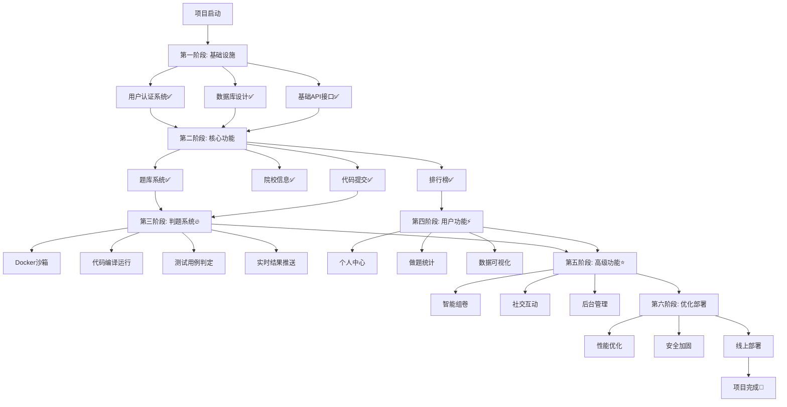

# 研路无忧 - 项目开发路线图



---

## 开发阶段详解

### ✅ 第一阶段: 基础设施 (已完成)
**时间**: Week 1-2  
**完成度**: 100%

- 用户认证系统 (JWT + Spring Security)
- 数据库设计 (11张表)
- 基础API接口 (12个接口)
- 前后端项目初始化

---

### ✅ 第二阶段: 核心功能 (已完成)
**时间**: Week 3-4  
**完成度**: 90%

- 题库管理系统
- 院校信息系统
- 代码提交功能
- 排行榜系统
- 前端页面 (7个)

---

### 🔥 第三阶段: 判题系统 (进行中)
**时间**: Week 5-6  
**完成度**: 0%  
**优先级**: P0 (最高)

**目标**: 实现代码在线编译运行和自动判题

#### 技术方案:
1. **Docker沙箱**
   - 资源隔离
   - 时间限制
   - 内存限制
   - 安全控制

2. **编译运行**
   - C++: g++编译
   - Java: javac + java
   - Python: python3

3. **判题逻辑**
   - 编译代码
   - 运行测试用例
   - 对比输出结果
   - 返回判题状态

4. **消息队列**
   - 异步判题
   - 负载均衡
   - 结果推送

---

### ⚡ 第四阶段: 用户功能 (待开发)
**时间**: Week 7-8  
**完成度**: 0%  
**优先级**: P1 (高)

**目标**: 完善用户个人中心和数据统计

#### 功能列表:
1. **个人中心**
   - 用户信息展示
   - 头像上传
   - 修改资料
   - 修改密码

2. **做题统计**
   - AC题目列表
   - 做题日历
   - 刷题趋势
   - 科目统计

3. **成长体系**
   - 用户等级
   - 成就勋章
   - 连续签到

---

### ⭐ 第五阶段: 高级功能 (规划中)
**时间**: Week 9-12  
**完成度**: 0%  
**优先级**: P2 (中)

**目标**: 增强平台功能和用户粘性

#### 功能模块:
1. **智能组卷**
   - 难度分层
   - 科目分布
   - 历史试卷
   - 模拟考试

2. **社交互动**
   - 用户关注
   - 动态发布
   - 题目讨论
   - 题解分享

3. **后台管理**
   - 用户管理
   - 题目管理
   - 内容审核
   - 数据统计

---

### 🚀 第六阶段: 优化部署 (未来)
**时间**: Week 13-16  
**完成度**: 0%  
**优先级**: P3 (低)

**目标**: 性能优化和上线部署

#### 优化内容:
1. **性能优化**
   - Redis缓存
   - SQL优化
   - 前端优化
   - CDN加速

2. **安全加固**
   - 验证码
   - 限流防刷
   - SQL注入防护
   - XSS防护

3. **线上部署**
   - 服务器配置
   - Nginx代理
   - SSL证书
   - CI/CD

---

## 功能完成度看板

### 后端功能
| 模块 | 状态 | 完成度 | 负责人 |
|------|------|--------|--------|
| 用户认证 | ✅ Done | 100% | - |
| 题库管理 | ✅ Done | 90% | - |
| 院校信息 | ✅ Done | 100% | - |
| 代码提交 | ✅ Done | 70% | - |
| 排行榜 | ✅ Done | 100% | - |
| 判题系统 | 🔥 Todo | 0% | 待分配 |
| 个人中心 | ⏳ Pending | 0% | 待分配 |
| 智能组卷 | ⏳ Pending | 0% | 待分配 |
| 后台管理 | ⏳ Pending | 0% | 待分配 |

### 前端功能
| 页面 | 状态 | 完成度 | 负责人 |
|------|------|--------|--------|
| 首页 | ✅ Done | 100% | - |
| 登录注册 | ✅ Done | 100% | - |
| 题库列表 | ✅ Done | 90% | - |
| 题目详情 | ✅ Done | 85% | - |
| 学校列表 | ✅ Done | 100% | - |
| 排行榜 | ✅ Done | 100% | - |
| 个人中心 | 🔥 Todo | 0% | 待分配 |
| 组卷页面 | ⏳ Pending | 0% | 待分配 |
| 后台管理 | ⏳ Pending | 0% | 待分配 |

---

## 里程碑时间线

```
Week 1-2  ████████████ 基础设施完成 ✅
Week 3-4  ████████████ 核心功能完成 ✅
Week 5-6  ░░░░░░░░░░░░ 判题系统开发 🔥 (当前阶段)
Week 7-8  ░░░░░░░░░░░░ 用户功能开发 ⚡
Week 9-10 ░░░░░░░░░░░░ 智能组卷开发 ⭐
Week 11   ░░░░░░░░░░░░ UI/UX优化
Week 12   ░░░░░░░░░░░░ 后台管理开发
Week 13   ░░░░░░░░░░░░ 社交功能开发
Week 14   ░░░░░░░░░░░░ 性能优化
Week 15   ░░░░░░░░░░░░ 安全加固
Week 16   ░░░░░░░░░░░░ 部署上线 🎉
```

---

## 技术债务管理

### 🔴 高优先级 (必须解决)
- [ ] 判题系统缺失 - 核心功能未实现
- [ ] 缺少单元测试 - 代码质量风险
- [ ] 缺少API文档 - Swagger集成

### 🟡 中优先级 (应该解决)
- [ ] 缺少日志监控 - 问题排查困难
- [ ] 缺少Redis缓存 - 性能优化空间
- [ ] 缺少角色权限 - 权限控制不完善

### 🟢 低优先级 (可以延后)
- [ ] 缺少数据爬虫 - 手动添加题目
- [ ] 缺少CI/CD - 手动部署
- [ ] 缺少压力测试 - 性能未知

---

## 风险评估矩阵

| 风险 | 可能性 | 影响 | 风险等级 | 应对措施 |
|------|--------|------|----------|----------|
| 判题系统技术难度大 | 中 | 高 | 🔴 高 | 参考开源OJ |
| Docker环境配置复杂 | 低 | 中 | 🟡 中 | 详细文档 |
| 性能瓶颈 | 低 | 中 | 🟡 中 | 引入缓存 |
| 安全漏洞 | 中 | 高 | 🔴 高 | 代码审查 |
| 用户体验差 | 低 | 低 | 🟢 低 | UI测试 |

---

## 资源需求

### 开发资源
- 后端开发: 1人
- 前端开发: 1人
- 测试: 1人 (兼职)

### 技术资源
- 开发服务器: 本地
- 测试服务器: 本地Docker
- 生产服务器: 云服务器 (2C4G)

### 时间资源
- 开发周期: 16周
- 当前进度: Week 5
- 剩余时间: 11周

---

## 成功标准

### MVP (最小可行产品)
- [x] 用户可以注册登录
- [x] 用户可以查看题目
- [ ] 用户可以提交代码并看到AC/WA结果
- [ ] 用户可以查看排行榜
- [ ] 用户可以查看个人统计

### V1.0 (第一版本)
- [ ] 完整的判题系统
- [ ] 完整的个人中心
- [ ] 智能组卷功能
- [ ] 后台管理功能
- [ ] 移动端适配

### V2.0 (第二版本)
- [ ] 社交功能
- [ ] AI辅助功能
- [ ] 数据分析
- [ ] 性能优化
- [ ] 正式上线

---

**当前阶段**: 第三阶段 - 判题系统开发 🔥  
**下一里程碑**: 判题系统上线  
**项目健康度**: 🟢 良好  
**团队士气**: 💪 高昂

**继续加油！向着100%完成度前进！** 🚀
